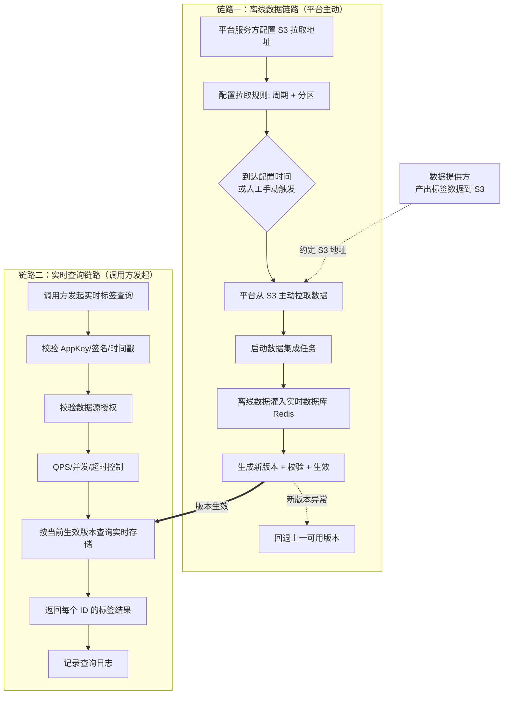
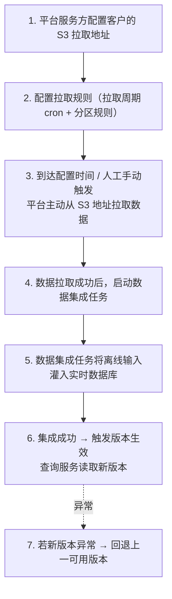
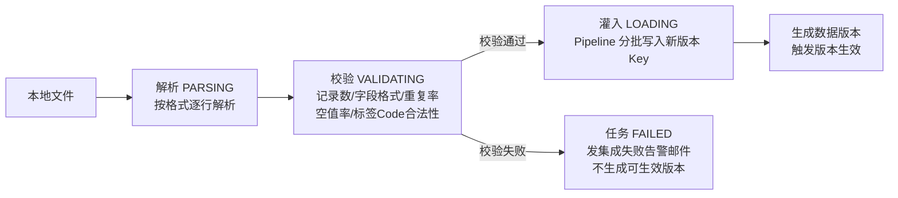
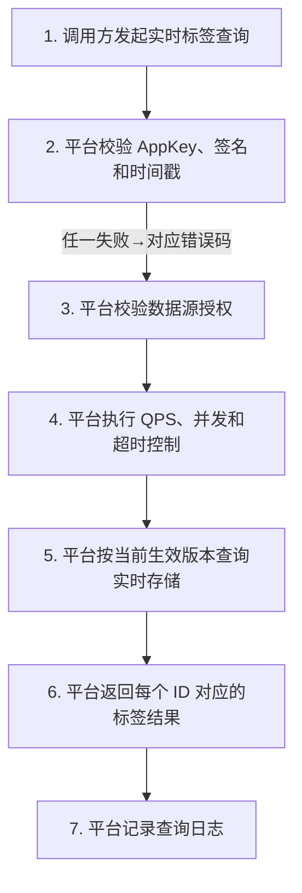
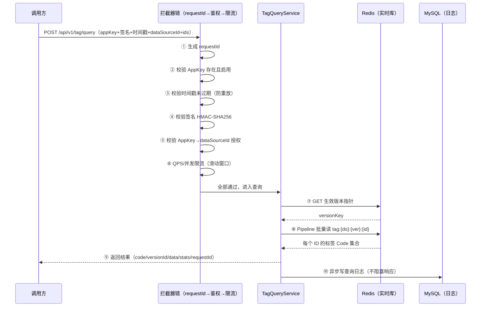
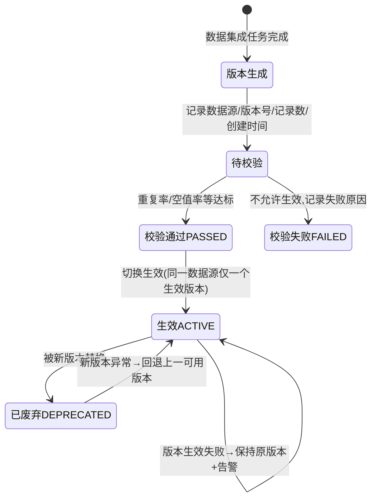
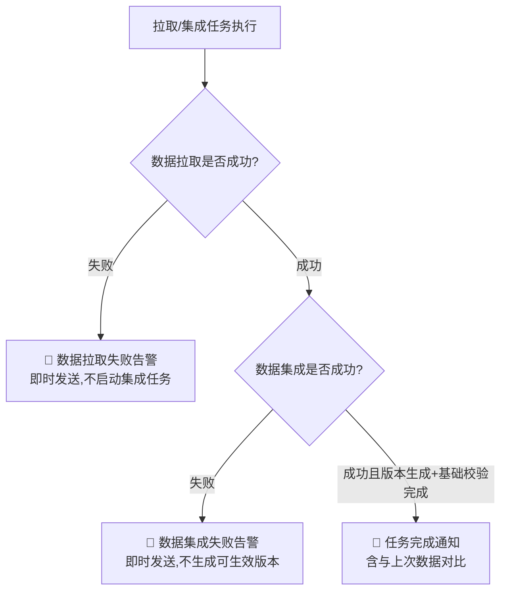

# 实时标签查询服务 — 项目流程以及需求

> 本文档基于《标签实时查询需求.pdf》（PRD-V1.0 / 文档版本 v0.3，更新时间 2026-06-22）整理。
> 用途：说明本项目**要做什么（功能清单）**以及**数据怎么流转（全流程）**。
> 配套文档：《开发计划.md》（怎么一步步做出来）。

---

## 目录

- [一、项目概述](#一项目概述)
- [二、需求清单（功能列表）](#二需求清单功能列表)
- [三、系统总体流程（两条链路）](#三系统总体流程两条链路)
- [四、数据链路：数据如何进入系统（S3 拉取 → 入库）](#四数据链路数据如何进入系统s3-拉取--入库)
- [五、查询链路：调用方如何查询标签](#五查询链路调用方如何查询标签)
- [六、实时标签查询接口详述](#六实时标签查询接口详述)
- [七、S3 数据文件格式要求](#七s3-数据文件格式要求)
- [八、数据版本管理流程](#八数据版本管理流程)
- [九、任务结果通知流程（邮件）](#九任务结果通知流程邮件)
- [十、日志与监控要求](#十日志与监控要求)
- [十一、性能要求](#十一性能要求)
- [十二、本期范围与边界](#十二本期范围与边界)
- [十三、参与方与责任边界](#十三参与方与责任边界)

---

## 一、项目概述

### 1.1 产品信息

| 项目 | 内容 |
|------|------|
| 产品名称 | 实时标签查询服务 |
| 产品形态 | 后端服务 / 标准接口能力（**无前端页面**） |
| 所属模块 | 标签查询 / 数据服务 |
| 版本 | v0.3（草稿） |

### 1.2 业务背景：客户线索评级场景

客户需要在用户留资后**快速补全标签**，用于线索评级、去重和经销商下发：

1. 用户在线索入口留资；
2. 客户侧采集用户手机号，并按约定方式加密（前期建模使用 **MD5 加盐**）；
3. 客户或对接方调用平台**实时标签查询服务**；
4. 客户按**授权数据源**查询该用户命中的标签；
5. 平台返回标签结果；
6. 客户侧基于标签做线索评分、标签填充、去重和经销商下发。

### 1.3 已知硬性要求

| 项目 | 内容 |
|------|------|
| 时效要求 | 用户留资后 1-2 分钟内完成后续处理，因此查询需**秒级返回** |
| 性能要求 | **QPS 1000、P99 秒级响应** |
| 数据规模 | **十亿级** PN ID，客户实际查询峰值约每日数十万次 |
| 查询标识 | 加密手机号（MD5 加盐） |
| 输出结果 | 手机号 / 用户标识对应的标签 Code 列表 |
| 数据更新 | **不定期全量替换** |
| 合规要求 | 实时 API 场景需法务确认 |

### 1.4 共性需求（为什么做成"统一"服务）

客户有不同接入场景，平台侧提供**同一套标准服务能力**：

1. 统一实时标签查询服务；
2. 实时标签查询服务**内置鉴权、授权和限流**；
3. 统一标签数据拉取、数据集成、版本生效和回退；
4. 统一查询日志、异常日志和监控告警。

---

## 二、需求清单（功能列表）

下表为 PDF 需求清单原文 + 本项目对应的功能模块拆解 + 当前开发状态。

| # | 需求名称 | 需求描述 | 优先级 | 对应功能模块 | 当前状态 |
|---|----------|----------|--------|--------------|----------|
| 1 | **实时标签查询服务** | 提供统一查询服务，支持调用方按用户标识**批量查询**授权范围内的标签 Code；服务内置鉴权、授权、限流、超时、空结果和异常返回能力 | **P0** | `TagQueryController` + `AuthService` + `RateLimitService` + `TagQueryService` | ⬜ 未开始（仅骨架） |
| 2 | **标签数据拉取与入库服务** | 支持配置客户 S3 拉取地址和拉取规则，由平台**定时主动拉取**离线标签数据；拉取成功后启动数据集成任务，将离线输入灌入实时数据库 | **P0** | `PullConfigService` + `PullTaskService` + `DataIntegrationService` + `S3Client` | ⬜ 未开始 |
| 3 | **日志与监控能力** | 记录查询日志、鉴权失败、限流、数据拉取、数据集成、版本生效和回退；监控 QPS、RT、P99、错误率、超时率、限流次数、命中率和实时库状态 | **P0** | `LogService` + `Metrics`（Prometheus） | ⬜ 未开始（Actuator 依赖已引入） |
| 4 | **数据版本管理能力** | 每次全量入库生成独立版本，支持版本校验、生效、查询追溯和**异常回退** | P1 | `VersionService` + `VersionController` | ⬜ 未开始 |

### 2.1 功能模块全景图（我们要开发的全部功能）

| 模块 | 功能点 | 说明 |
|------|--------|------|
| **查询服务** | 批量标签查询 | 单 ID 按批量特例处理；空结果不算错误 |
| | 生效版本路由 | 查询只读当前生效版本；单次请求内版本一致 |
| **安全体系** | AppKey 鉴权 | 校验身份存在且启用 |
| | 签名校验 | HMAC-SHA256，防篡改 |
| | 时间戳校验 | 防过期请求、防重放 |
| | 数据源授权 | AppKey 只能查被授权的数据源 |
| | QPS / 并发 / 超时控制 | 按调用方 + AppKey + 数据源维度限流 |
| **数据链路** | 拉取配置管理 | S3 地址、拉取周期（cron）、分区规则（LATEST / CURRENT_MONTH）、启停 |
| | 定时 / 手动拉取 | 到点自动拉 + 人工手动触发 |
| | 数据集成（ETL） | 解析 → 校验（记录数/字段格式/重复率/空值率/标签 Code 合法性）→ 全量替换入库 |
| **版本管理** | 版本生成 | 每次入库生成独立版本，记录数据源/版本号/记录数/校验状态/生效状态 |
| | 版本校验 | 校验通过才允许生效 |
| | 版本生效 | 同一数据源同一时间只有一个生效版本 |
| | 版本回退 | 新版本异常时回退上一可用版本 |
| **通知告警** | 拉取失败告警邮件 | 失败即时发送，不启动集成 |
| | 集成失败告警邮件 | 失败即时发送，不生成可生效版本 |
| | 任务完成通知邮件 | 含任务概况、数据情况、版本结果、与上次对比 |
| **日志监控** | 9 类日志 | 查询/鉴权失败/权限失败/限流/拉取/集成/版本生效/版本回退 |
| | 8 项监控指标 | QPS、RT/P99、错误率、超时率、限流次数、命中率、拉取成功率、集成成功率 |
| **管理 API** | AppKey 管理 | 注册/查询/更新/启停/授权数据源 |
| | 拉取配置管理 | 增删改查/启停 |
| | 拉取任务管理 | 手动触发/查状态/查历史 |
| | 版本管理 | 查列表/激活/回退 |
| | 运维接口 | 健康检查、Prometheus 指标 |

### 2.2 项目当前进度盘点

✅ **已完成（基础骨架）**：

- Maven 工程与全部依赖（Spring Boot 2.7 + MyBatis-Plus + Redis + Flyway + S3 SDK + 邮件 + Prometheus）
- 启动类 `TagQueryApplication`、健康检查 `HealthController`
- 错误码枚举 `ErrorCode`（14 种）、业务异常 `BizException`、全局异常处理 `GlobalExceptionHandler`
- 数据库 8 张表的 Flyway 脚本 `V1__init_schema.sql`
- 主配置 `application.yml`

⬜ **待开发（本计划补齐）**：实体层、DTO、鉴权/限流拦截器、查询核心、S3 拉取、数据集成、版本管理、调度、邮件、监控、测试与压测。

---

## 三、系统总体流程（两条链路）

PDF 3.1 节原文：*平台整体流程分为两条链路：第一条是平台按配置主动拉取离线标签数据，完成数据集成、版本生成和版本生效；第二条是调用方发起实时查询，平台完成鉴权、授权、限流、查询和日志记录。*

> PDF 第 4 页为总体流程图（图片形式），此处按原文用 Mermaid 重绘：



**两条链路的衔接点**：数据链路产出的"生效版本"，就是查询链路读取的数据。版本切换对查询方无感知，查询不中断。

---

## 四、数据链路：数据如何进入系统（S3 拉取 → 入库）

### 4.1 数据从哪来？—— 用户/客户如何"投入"数据

**关键点：平台不由客户主动提交数据，而是平台按配置主动从客户 S3 地址拉取。**

```
数据提供方（客户侧）
   │  ① 按约定格式生成标签文件，上传到约定的 S3 地址（分区目录）
   ▼
平台服务方（本系统）
   │  ② 按 pull_config 配置（地址/周期/分区规则）定时或手动触发拉取
   ▼
实时数据库（Redis）
      ③ 解析 → 校验 → 全量替换灌入 → 生成版本 → 生效
```

- 数据提供方职责：按约定生成标签数据，并产出到**平台可拉取的 S3 地址**；
- 平台服务方职责：提供数据拉取入库、实时查询、鉴权、授权、限流、日志、监控和版本管理能力；
- 调用方职责：申请调用身份，按授权范围调用实时标签查询服务。

### 4.2 数据链路 7 步流程（PDF 原文步骤）



### 4.3 拉取配置要求

| 配置项 | 要求 |
|--------|------|
| S3 拉取地址 | 支持为同一客户配置**一个或多个** S3 拉取地址 |
| 拉取周期 | 支持配置周期性拉取规则，例如每周一、每月 1 号（cron 表达式） |
| 分区规则 | 支持配置拉取**最新分区**（LATEST）或**当月分区**（CURRENT_MONTH） |
| 客户 / 数据源关系 | 每个拉取配置需关联客户和数据源 |
| 物理隔离关系 | **不同客户的拉取配置、数据源、实时库/存储空间需物理隔离** |
| 启停状态 | 支持启用或停用指定拉取配置 |

### 4.4 拉取与集成处理规则

**定时触发**：
1. 到达配置时间后，平台按拉取规则主动访问对应 S3 地址；
2. 平台按分区规则确定本次需要拉取的数据分区；
3. 数据拉取成功后，平台记录本次拉取结果；
4. 数据拉取成功后，平台**自动启动数据集成任务**；
5. 数据集成任务将离线输入灌入实时数据库；
6. 入库前按约定格式解析用户标识和标签 Code；
7. 入库时校验记录数、字段格式、重复率、空值率和标签 Code 合法性；
8. 数据更新采用**全量替换**。

**手动触发**：平台服务方手动发起拉取任务时，需指定**客户、数据源、S3 地址和目标分区**，其余流程与定时触发一致。

### 4.5 数据集成任务内部流程（ETL）



---

## 五、查询链路：调用方如何查询标签

### 5.1 查询链路 7 步流程（PDF 原文步骤）



### 5.2 查询时序图（一次请求的完整旅程）



### 5.3 处理规则（PDF 原文）

1. 平台校验 AppKey、签名和时间戳；
2. 平台校验 AppKey 是否有权访问指定 dataSourceId；
3. 平台按调用方、AppKey、数据源执行 QPS、并发和超时控制；
4. 平台**不区分 ID 类型**，按输入 ID 在授权数据源中匹配；
5. **单 ID 查询按批量查询特例处理**；
6. 查询结果从**当前生效数据版本**读取；
7. **不同客户之间的数据需要物理隔离**，调用方只能查询自身授权客户的数据源；
8. **单个调用方异常不得影响其他调用方**。

---

## 六、实时标签查询接口详述

### 6.1 输入参数

| 参数 | 说明 |
|------|------|
| AppKey | 调用方身份标识，用于鉴权和授权校验 |
| 签名 | 用于校验请求合法性 |
| 时间戳 | 用于防止过期请求和重放请求 |
| dataSourceId | 查询的数据源标识 |
| ids | 用户标识列表，支持单 ID 或批量 ID 查询 |

### 6.2 输出结果

| 返回内容 | 说明 |
|----------|------|
| 查询状态 | 成功、参数错误、鉴权失败、无权限、限流、超时、系统异常等 |
| 标签结果 | 每个用户标识对应的标签 Code 列表 |
| 空结果 | **ID 未命中时返回空标签结果，不作为系统异常** |
| 数据版本 | 返回结果需**可追溯到查询时命中的数据版本** |
| 请求标识 | 返回 **requestId**，用于日志追踪和问题排查 |

### 6.3 错误码表（14 种，PDF 原文文案）

| 错误码 | 原因 | 错误原因文案 |
|--------|------|--------------|
| 10001 | AppKey 不存在或已停用 | 调用身份无效，请确认 AppKey 是否正确或是否已启用 |
| 10002 | 签名校验失败 | 签名校验失败，请检查签名生成规则 |
| 10003 | 时间戳过期 | 请求已过期，请重新发起请求 |
| 10004 | 传入的 dataSourceId 非合法授权数据源 | 以下为无效数据源：{dataSourceId} |
| 10101 | ids 为空 | 用户标识不能为空 |
| 10102 | ids 超过单次批量上限 | 单次查询 ID 数超过上限：{maxBatchSize} |
| 10103 | 请求参数格式不符合要求 | 输入参数格式不符合接口要求 |
| 10201 | 触发 QPS 或并发限制 | 当前任务配置已达到调用限制，请稍后重试 |
| 10202 | 查询超时 | 查询超时，请稍后重试 |
| 10301 | 实时数据库不可用 | 实时查询服务暂不可用，请稍后重试 |
| 10302 | 系统异常 | 系统异常，请联系平台服务方排查 |

> 说明：**ID 未命中时返回空标签结果，不作为错误码返回。**
> 以上错误码已在项目骨架的 `ErrorCode.java` 中定义完毕。

---

## 七、S3 数据文件格式要求

客户侧 S3 数据文件按 `|` 分段：**`用户标识|标识类型|Code1|Code2|...|`**

| 位置 | 含义 | 规则 |
|------|------|------|
| 第 1 段 | 用户标识 | 作为查询 Key（与调用方传入的加密 ID 一致，MD5 加盐口径） |
| 第 2 段 | 标识类型 | 标识 ID 的种类（如加密手机号 PN） |
| 第 3 段及以后 | 标签 Code | 作为该用户命中的标签列表 |

示例（一行一个用户）：

```text
e10adc3949ba59abbe56e057f20f883e|PN|TAG_A001|TAG_B003|TAG_C007|
5d41402abc4b2a76b9719d911017c592|PN|TAG_B003|
```

> 入库校验要求：记录数、字段格式、重复率、空值率、标签 Code 合法性；数据更新为**全量替换**。

---

## 八、数据版本管理流程

### 8.1 版本生命周期（状态机）



### 8.2 版本规则（PDF 原文）

**版本生成规则**：
1. 每次数据集成任务完成后，平台生成一个独立数据版本；
2. 数据版本需记录数据源、版本号、记录数、创建时间、校验状态和生效状态；
3. 数据版本**必须完成校验后，才允许进入待生效状态**。

**生效规则**：
1. 同一数据源同一时间只能有一个生效版本；
2. 不同客户的数据版本需按物理隔离的数据源分别管理；
3. 待生效版本切换成功后，实时标签查询接口读取新版本；
4. **版本切换过程中，同一查询请求只命中同一数据版本**；
5. 生效动作需记录旧版本、新版本、生效时间和操作结果。

**回退规则**：
1. 新版本异常时，平台需支持回退到上一可用版本；
2. 回退成功后，实时标签查询接口读取回退后的版本；
3. 回退动作需记录回退前版本、回退后版本、回退时间和原因。

**异常规则**：

| 异常 | 处理方式 |
|------|----------|
| 版本校验失败 | 不允许生效，记录失败原因 |
| 版本生效失败 | 保持原生效版本，记录失败原因并告警 |
| 版本回退失败 | 保持当前生效版本，记录失败原因并告警 |

---

## 九、任务结果通知流程（邮件）

### 9.1 触发规则



> 任务结果通知邮件需**覆盖定时触发和手动触发两类任务**。

### 9.2 三类邮件模板（PDF 原文）

| 邮件类型 | 发送时机 | 邮件标题 | 邮件内容 |
|----------|----------|----------|----------|
| 任务完成通知 | 数据集成完成、版本生成并完成基础校验后 | 【联合计算中心】实时标签服务数据同步完成通知 | 任务概况：客户 {customerName}；触发方式 {triggerType}；S3 地址 {s3Path}；目标分区 {partition}；开始 {startTime}；结束 {endTime}；状态：完成。本次数据情况：文件数 {fileCount}；文件总大小 {fileSize}；ID 数量 {idCount}。版本结果：版本号 {versionId}；版本状态 {versionStatus}。与上次对比：文件总大小变化 {fileSizeChange}；ID 数量变化 {idCountChange} |
| 数据拉取失败告警 | S3 地址不可访问、目标分区不存在或数据拉取失败时 | 【联合计算中心】实时标签服务数据拉取失败告警 | 任务概况：客户/触发方式/S3 地址/目标分区/起止时间；状态：失败；失败原因 {failureReason} |
| 数据集成失败告警 | 数据拉取成功但数据集成失败时 | 【联合计算中心】实时标签服务数据集成失败告警 | 同上结构，失败原因 {failureReason} |

---

## 十、日志与监控要求

### 10.1 日志记录规则（9 类）

| 日志类型 | 记录内容 |
|----------|----------|
| 查询调用日志 | requestId、AppKey、dataSourceId、ID 数量、命中数量、耗时、状态、数据版本 |
| 鉴权失败日志 | AppKey、签名校验结果、时间戳校验结果、失败原因、请求时间、来源 IP |
| 权限失败日志 | AppKey、dataSourceId、权限校验结果、失败原因 |
| 限流日志 | AppKey、限流维度、阈值、当前值、触发时间 |
| 数据拉取日志 | 客户、S3 地址、拉取规则、分区、开始/结束时间、状态、失败原因 |
| 数据集成日志 | 数据源、版本、记录数、开始/结束时间、状态、失败原因 |
| 版本生效日志 | 数据源、旧版本、新版本、生效时间、状态、失败原因 |
| 版本回退日志 | 数据源、回退前版本、回退后版本、回退时间、状态、失败原因 |

### 10.2 监控指标（8 项）

| 指标 | 说明 |
|------|------|
| QPS | 实时标签查询接口调用量 |
| RT / P99 | 接口响应耗时 |
| 错误率 | 查询失败请求占比 |
| 超时率 | 查询超时请求占比 |
| 限流次数 | 触发限流的请求数量 |
| 命中率 | 查询命中标签结果的比例 |
| 拉取成功率 | S3 拉取任务成功比例 |
| 数据集成成功率 | 数据集成任务成功比例 |

---

## 十一、性能要求

| 指标 | 要求 |
|------|------|
| QPS | 客户维度，按 **QPS 1000** 设计，最终以调用方确认和压测结果为准 |
| 响应耗时 | **P99 秒级响应** |
| 批量上限 | 单次批量查询 ID 上限待压测确认 |

---

## 十二、本期范围与边界

| 范围 | 内容 |
|------|------|
| ✅ **包含** | 实时标签查询服务、标签数据拉取与入库服务、数据版本管理能力、查询日志、数据更新日志、服务监控 |
| ❌ **不包含** | 页面产品、客户侧业务权限过滤、客户侧配额策略、线索评分模型、标签业务含义解释、经销商系统下发、客户定制接口 |

> 关键约束：**不按客户单独定制接口**，也不处理客户侧业务权限、评分、分流和结果加工。

---

## 十三、参与方与责任边界

| 参与方 | 职责 |
|--------|------|
| 调用方 | 申请调用身份，按授权范围调用实时标签查询服务 |
| 数据提供方 | 按约定生成标签数据，并产出到平台可拉取的 S3 地址 |
| 平台服务方（本项目） | 提供数据拉取入库、实时查询、鉴权、授权、限流、日志、监控和版本管理能力 |

---

> **下一步**：阅读《开发计划.md》，按 2 周（10 个工作日）的节奏把上述功能逐一落地。
